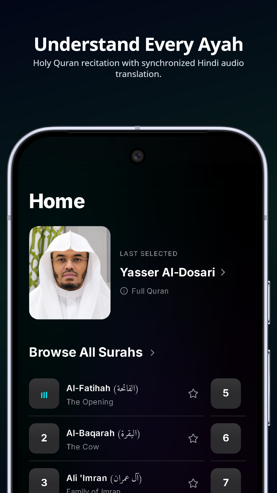
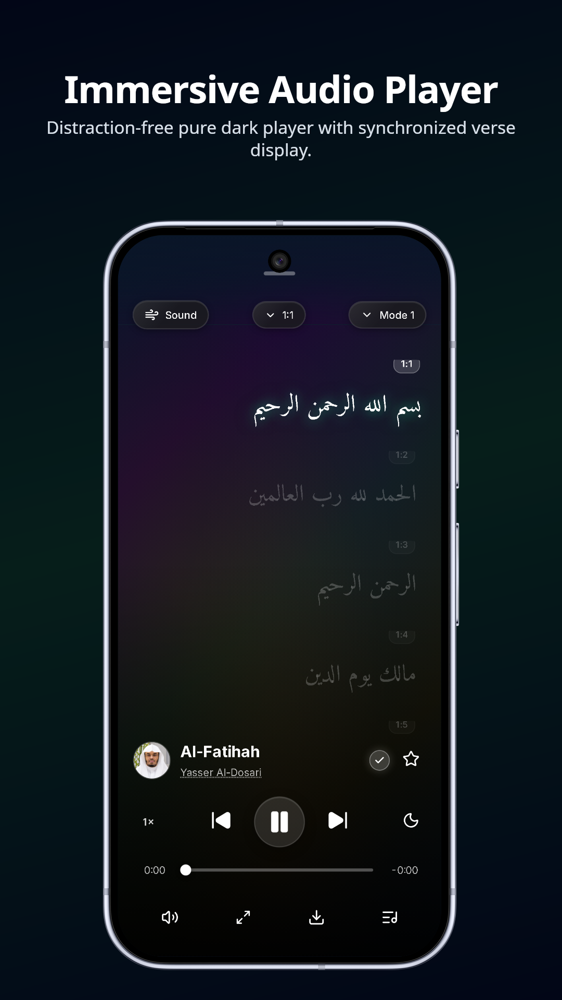
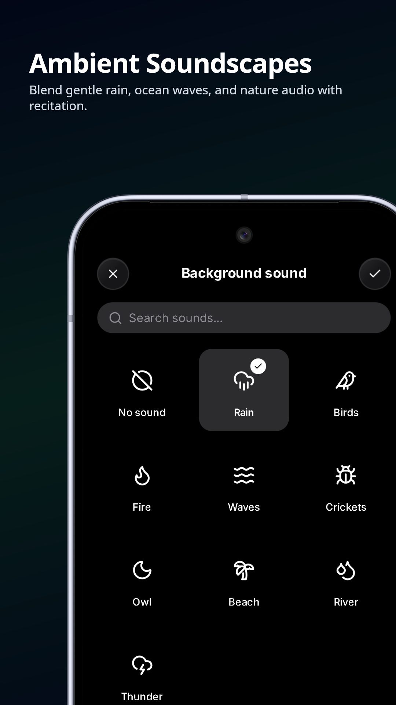
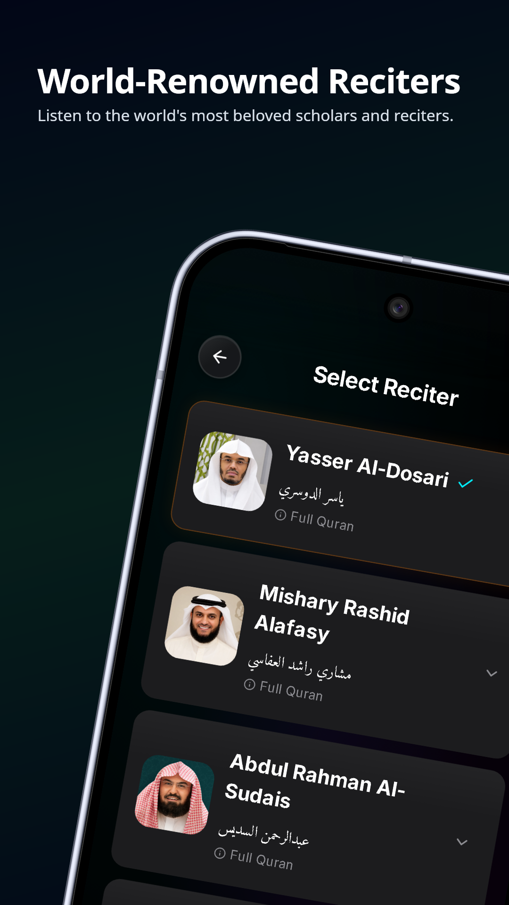
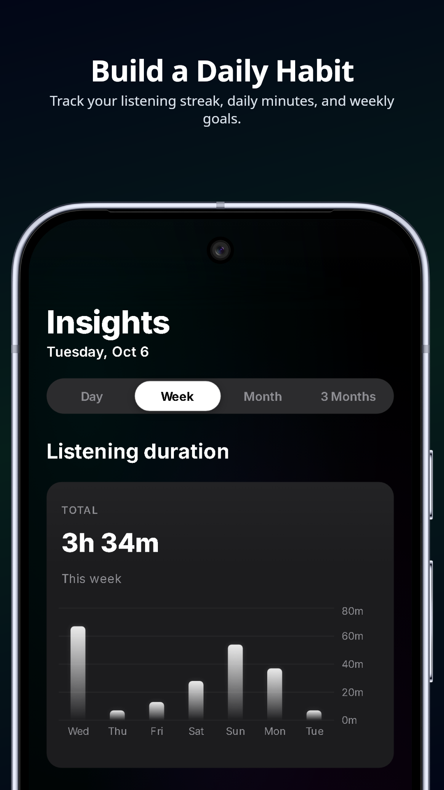

# Tarjuma (ترجمة) — Holy Quran with Hindi Translation

**A serene, state-of-the-art mobile application designed for listening to the Holy Quran with authentic Hindi verse-by-verse translation.**  
Featuring world-renowned reciters, ambient background soundscapes, daily Tadabbur insights, and a breathtaking Pure Black Liquid Glass UI.

---

## 📸 App Showcase

| Home & Curated Mixes | Full-Screen Player | Ambient Sound Mixer |
| :---: | :---: | :---: |
|  |  |  |

| Renowned Reciters | Listening Insights |
| :---: | :---: |
|  |  |

---

## ✨ Key Features

- **📖 Complete 114 Surahs & 30 Paras:** High-fidelity verse-by-verse recitation synchronized with authentic, easy-to-understand Hindi translation.
- **🎙️ Renowned World-Class Reciters:** Choose from iconic reciters including:
  - Mishary Rashid Alafasy
  - Abdul Rahman Al-Sudais
  - Maher Al-Muaiqly
  - Sa'ud ash-Shuraim
  - Abdul Basit Abdul Samad
  - Abu Bakr Al-Shatri
  - Yasser Al-Dosari
  - Hazza Al-Balushi
  - Yergen Kumarov
- **🌿 Ambient Sound Mixer:** Layer serene natural soundscapes underneath recitation — rain, forest birds, ocean waves, night crickets, fireplace, and calming winds with independent volume controls.
- **✨ Liquid Glass Design System:** AMOLED pure-black aesthetic with frosted glass refraction, dynamic ambient lighting gradients, and fluid micro-interactions.
- **⚡ 120Hz High Refresh Rate:** Native display mode optimization unlocks 90Hz, 120Hz, and 144Hz fluid animation on supported Android devices.
- **🎧 Background Playback & MediaSession:** Full background playback support with native lock screen controls, playback notification actions, and headset button integration.
- **📊 Daily Tadabbur & Insights:** Track daily listening minutes, maintain streaks, review weekly charts, and monitor surahs completed.
- **🎯 Made For You Mixes:** Curated playlists tailored for specific moments — *Focus & Work*, *Sleep*, *Study*, and *Bookmarked Surahs*.
- **🚀 In-App Self-Updates:** Built-in update engine checks for new releases, streams download progress, and initiates seamless APK upgrades.

---

## 🛠️ Technology Stack

| Layer | Technologies |
| :--- | :--- |
| **Frontend Core** | React 18, Vite, React Router v6 |
| **State Management** | Zustand (persistent local stores with cloud synchronization) |
| **Audio Engine** | Howler.js, HTML5 Audio, Web Audio API, Cache API |
| **Styling & UI** | Pure Vanilla CSS (Design Tokens, Liquid Glass blur, Responsive Layouts) |
| **Mobile Runtime** | Capacitor (Android Bridge), Android MediaSession, Local Notifications |
| **Backend & CDN** | Supabase (User preferences & telemetry), Cloudflare R2 (Global high-speed audio CDN) |
| **Graphics & Icons** | Lucide React, Recharts |

---

## 🔒 Security Architecture

Tarjuma adheres to strict security standards to ensure no backend secrets or private keys are ever bundled or exposed:

- **Decoupled Client Variables:** Only public environment variables prefixed with `VITE_` are exposed to the client bundle. Private API keys and storage secrets remain server-side.
- **Protected Environment Files:** Local `.env` files, keystores, Android signing configs, and database seed scripts are strictly ignored in `.gitignore`.
- **Database Row Level Security (RLS):** All Supabase tables are secured with authenticated user-scoped access policies.
- **Android Signing Isolation:** Release keystore passwords and aliases are decoupled from version control via `android/gradle.properties` (with template provided in `gradle.properties.example`).

---

## 🚀 Getting Started

### Prerequisites

- **Node.js**: `v18.x` or later (LTS recommended)
- **npm**: `v9.x` or later
- **Android Studio**: Ladybug / Meerkat (for building native Android APKs)
- **Java**: JDK 17 or JDK 21

## 📄 License

This project is licensed under the **GNU General Public License v3.0** (GPL-3.0).  
See the [LICENSE.txt](LICENSE.txt) file for full license terms and conditions.

---

Crafted with reverence, precision, and dedication to spiritual peace.  
**Tarjuma Team**

